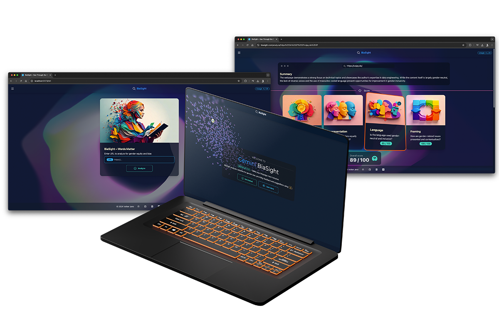
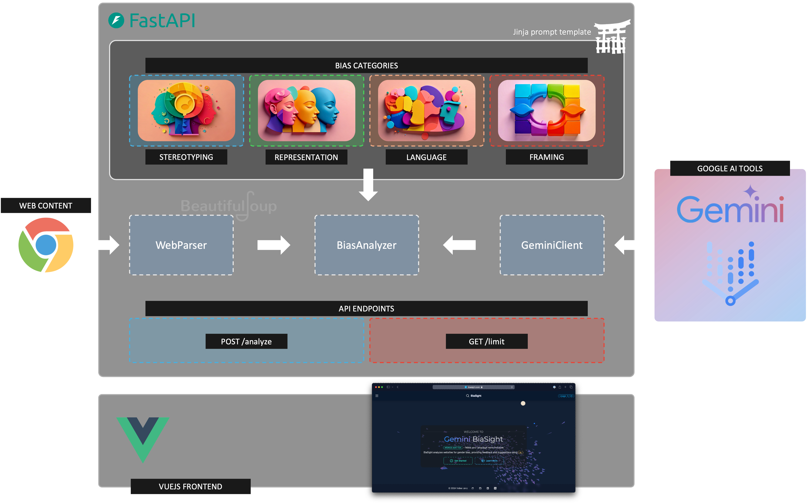

# BiaSight - Gender Bias Detection on Websites using AI


Words matter. In a world where gender inequality persists despite decades of progress, BiaSight addresses one of the
most pervasive yet often overlooked aspects of discrimination: the language we use in our digital spaces. BiaSight uses
the power of Google's cutting-edge AI, including Gemini, to analyze and improve the inclusivity of online content.

While content creators and website authors often focus on performance, usability, and visual appeal, the impact of words
on discrimination against women and girls and how this impacts equality is frequently underestimated. BiaSight aims to
change this by providing an intuitive, AI-driven analysis of web content across various equality categories, much like
how Google PageSpeed Insights has become an indispensable tool for web performance optimization.

The vision of BiaSight is to make gender-inclusive language as integral to web development as responsive design or SEO
optimization and to inspire creators for change.

Remember, words matter. They shape perceptions, influence behaviors, and can either reinforce or challenge the gender
inequalities that persist in our society.

**Try it yourself**: [biasight.com](https://biasight.com/)

This project was created as part of the [She Builds AI Hackathon 2024](https://womentechmakers.devpost.com/).



---

## Backend

The BiaSight backend is a powerful engine built with FastAPI and Python. It leverages BeautifulSoup to extract readable
content from web pages, preparing it for analysis. Using Jinja templating, prompt generation is modularized, allowing
seamless integration of web content into advanced prompts for Google’s Gemini LLM.

To ensure both accurate and deterministic results, Gemini is configured to use JSON mode for structured output and a
low-temperature setting is applied to minimize variability in its generation. Pydantic ensures robust data modeling and
validation, while Poetry manages dependencies efficiently. Docker streamlines deployment, and Ruff, combined with
GitHub Actions, maintains high code quality through automated testing and linting.

For optimal performance and user experience, the backend employs a TTLCache, reducing analysis time by caching recent
results. This architecture fosters easy and secure extensibility, allowing for future enhancements and integrations as
BiaSight continues to evolve.

## Frontend

The frontend is powered by Vue 3 and Vite, supported by daisyUI and Tailwind CSS for efficient frontend development.
Together, these tools provide users with a sleek and modern interface for seamless interaction with the backend.



This is the frontend part of the project. **Backend**: [biasight](https://github.com/vojay-dev/biasight)

---

## Project setup

Ensure to configure the correct API endpoint for local or live usage in `src/config.js`.

```sh
npm install
```

## Run

```sh
npm run dev
```

## Build

```sh
npm run build
```
